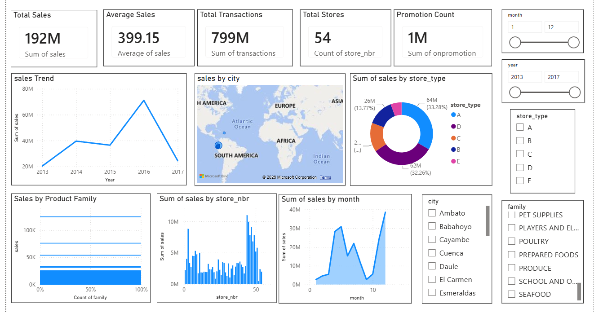

# 📈 Predictive Analytics Using Historical Data

## Overview

This project focuses on **Predictive Analytics Using Historical Sales Data** to forecast future sales trends.

The solution follows an end-to-end data science workflow including data preprocessing, exploratory data analysis, feature engineering, machine learning model development, evaluation, prediction, and visualization.

The project demonstrates how historical retail sales data can be transformed into meaningful business insights and used to build predictive models using machine learning techniques.

---

# Objectives

* Analyze historical sales data
* Clean and preprocess raw datasets
* Perform exploratory data analysis
* Engineer meaningful time-based features
* Build predictive machine learning models
* Evaluate model performance
* Forecast future sales trends
* Visualize business insights using Power BI

---

# Dataset

The project uses the **Store Sales Time Series Forecasting Dataset**.

### Dataset Files Used

* train.csv
* test.csv
* stores.csv
* transactions.csv
* holidays_events.csv
* oil.csv

### Dataset Availability

Due to GitHub file size limitations, the dataset files are not uploaded to this repository.

Download the dataset and place the files inside:

```
data/
```

Required structure:

```
data/
│
├── train.csv
├── test.csv
├── stores.csv
├── transactions.csv
├── holidays_events.csv
└── oil.csv
```

---

# Technologies Used

## Programming Language

* Python

## Libraries

* Pandas
* NumPy
* Matplotlib
* Seaborn
* Scikit-learn
* Joblib

## Tools

* Visual Studio Code
* Power BI
* Git & GitHub

---

# Project Structure

```
Sales_Forecasting/
│
├── src/
│   ├── eda.py
│   ├── preprocessing.py
│   ├── feature_engineering.py
│   ├── train_model.py
│   └── evaluate_model.py
│
├── dashboard/
│   ├── Sales_Forecasting.pbix
│   └── dashboard.png
│
├── main.py
├── README.md
├── requirements.txt
└── .gitignore
```

> Note: Dataset files, trained model files, and generated output files are excluded from GitHub due to size limitations.

---

# Workflow

## 1. Exploratory Data Analysis (EDA)

Performed analysis:

* Loaded multiple datasets
* Analyzed dataset structure
* Checked missing values
* Checked duplicate records
* Studied sales distribution
* Identified important sales trends
* Created visualizations

---

## 2. Data Preprocessing

Performed preprocessing steps:

* Converted date columns
* Handled missing values
* Removed duplicate records
* Combined multiple datasets
* Prepared clean data for modeling

---

## 3. Feature Engineering

Created important predictive features:

* Year
* Month
* Day
* Weekday
* Quarter
* Weekend Indicator
* Time Index
* Lag Features
* Rolling Average Features
* Holiday Indicator

---

## 4. Model Building

Machine Learning Models:

* Linear Regression
* Random Forest Regressor
* Gradient Boosting Regressor

---

## 5. Model Evaluation

The models were evaluated using:

* Mean Absolute Error (MAE)
* Root Mean Squared Error (RMSE)
* R² Score

---

## 6. Prediction

The trained model generates sales predictions based on historical patterns.

Generated outputs:

* Predicted sales values
* Model performance metrics
* Prediction visualizations

---

## 7. Dashboard

Power BI dashboard provides interactive business insights.

Dashboard includes:

* Executive Overview
* Total Sales KPI
* Average Sales
* Sales Trend Analysis
* Sales by Product Family
* Sales by Store
* Monthly Sales Analysis
* Holiday Impact Analysis
* Store Performance
* Interactive Filters


## Dashboard Preview



---

# Machine Learning Pipeline

```
Raw Data
    │
    ▼
Exploratory Data Analysis
    │
    ▼
Data Preprocessing
    │
    ▼
Feature Engineering
    │
    ▼
Model Training
    │
    ▼
Model Evaluation
    │
    ▼
Sales Prediction
    │
    ▼
Power BI Dashboard
```

---

# Key Features

* Historical sales analysis
* Data cleaning and preprocessing
* Feature engineering
* Predictive modeling
* Sales forecasting
* Regression model comparison
* Model evaluation
* Business intelligence dashboard
* End-to-end machine learning workflow

---

# Output

The project generates:

* Cleaned dataset
* Feature-engineered dataset
* Trained machine learning model
* Sales prediction results
* Visualization graphs
* Power BI dashboard

---

# Future Enhancements

* Implement advanced forecasting models:
    * ARIMA
    * Prophet
    * XGBoost
    * LightGBM

* Deploy model using Flask or Streamlit

* Create real-time sales prediction API

* Automate model retraining pipeline

---

# How to Run

## 1. Clone Repository

```bash
git clone <repository-url>

cd Sales_Forecasting
```

---

## 2. Install Dependencies

```bash
pip install -r requirements.txt
```

---

## 3. Add Dataset

Place dataset files inside:

```
data/
```

---

## 4. Run Complete Pipeline

```bash
python main.py
```

---

## Run Individual Steps

```bash
python src/eda.py

python src/preprocessing.py

python src/feature_engineering.py

python src/train_model.py

python src/evaluate_model.py
```

---

# Skills Demonstrated

* Data Cleaning
* Exploratory Data Analysis
* Feature Engineering
* Machine Learning
* Predictive Analytics
* Regression Modeling
* Time-Series Feature Engineering
* Model Evaluation
* Power BI Dashboard Development
* Python Programming
* Git & GitHub

---

# Author

**Anusree M**

Data Science & Machine Learning Enthusiast

---

# License

This project is created for educational and internship purposes.